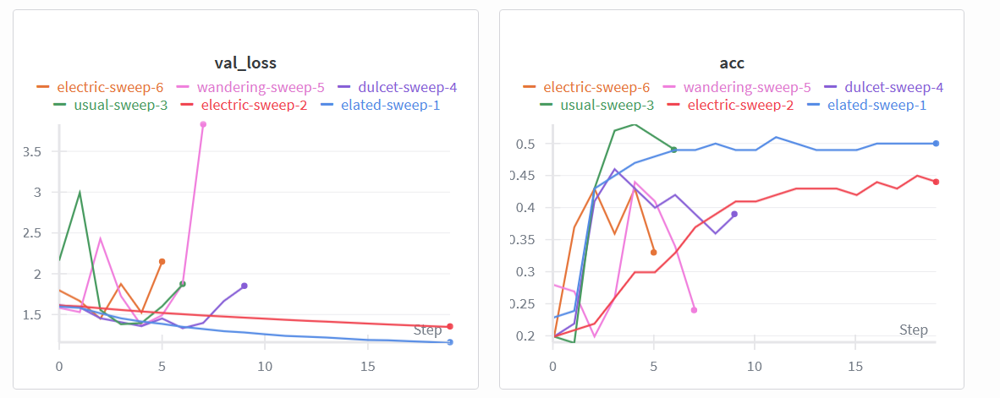
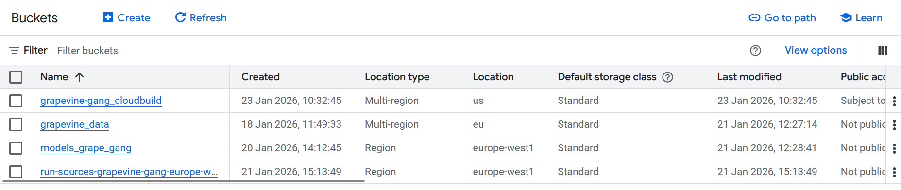
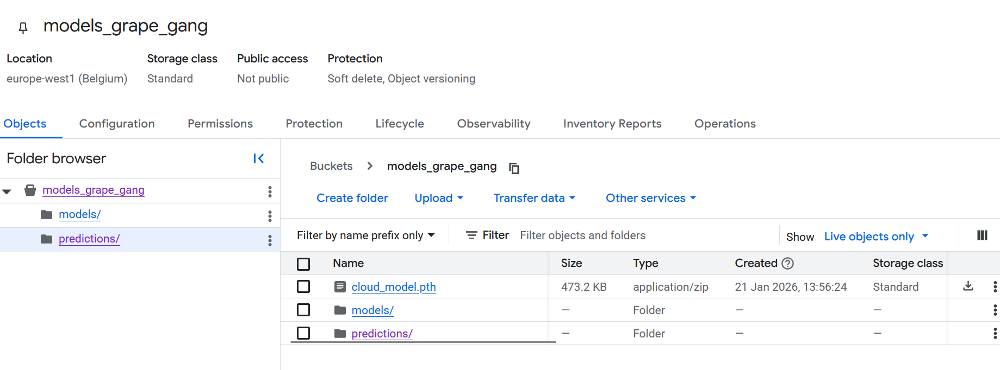
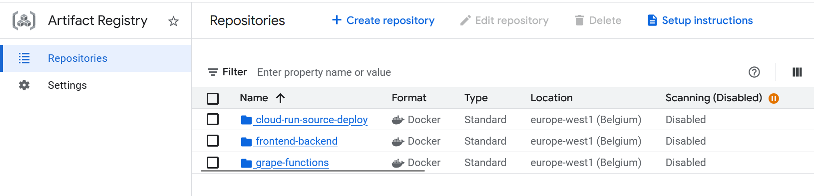
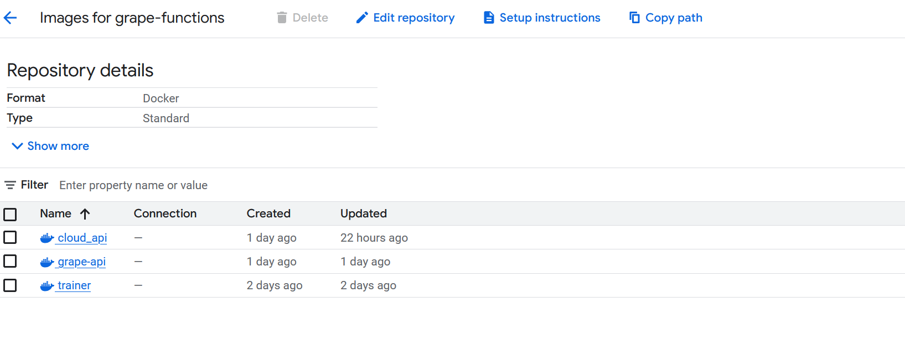
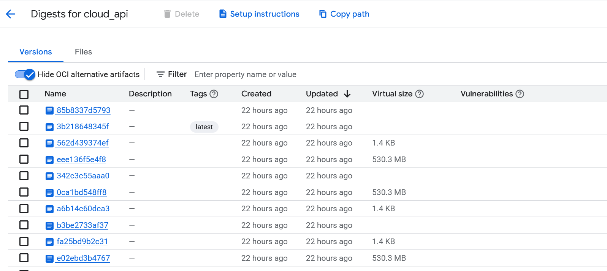
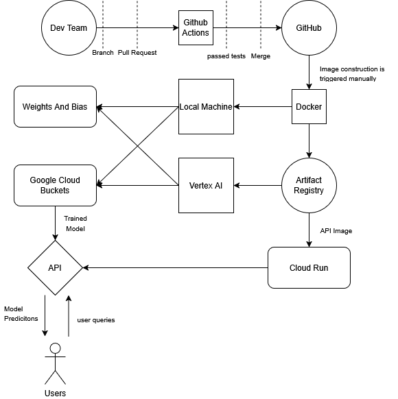

# Exam template for 02476 Machine Learning Operations

This is the report template for the exam. Please only remove the text formatted as with three dashes in front and behind
like:

```--- question 1 fill here ---```

Where you instead should add your answers. Any other changes may have unwanted consequences when your report is
auto-generated at the end of the course. For questions where you are asked to include images, start by adding the image
to the `figures` subfolder (please only use `.png`, `.jpg` or `.jpeg`) and then add the following code in your answer:

``

In addition to this markdown file, we also provide the `report.py` script that provides two utility functions:

Running:

```bash
python report.py html
```

Will generate a `.html` page of your report. After the deadline for answering this template, we will auto-scrape
everything in this `reports` folder and then use this utility to generate a `.html` page that will be your serve
as your final hand-in.

Running

```bash
python report.py check
```

Will check your answers in this template against the constraints listed for each question e.g. is your answer too
short, too long, or have you included an image when asked. For both functions to work you mustn't rename anything.
The script has two dependencies that can be installed with

```bash
pip install typer markdown
```

or

```bash
uv add typer markdown
```

## Overall project checklist

The checklist is *exhaustive* which means that it includes everything that you could do on the project included in the
curriculum in this course. Therefore, we do not expect at all that you have checked all boxes at the end of the project.
The parenthesis at the end indicates what module the bullet point is related to. Please be honest in your answers, we
will check the repositories and the code to verify your answers.

### Week 1

* [x] Create a git repository (M5)
* [x] Make sure that all team members have write access to the GitHub repository (M5)
* [x] Create a dedicated environment for you project to keep track of your packages (M2)
* [x] Create the initial file structure using cookiecutter with an appropriate template (M6)
* [x] Fill out the `data.py` file such that it downloads whatever data you need and preprocesses it (if necessary) (M6)
* [x] Add a model to `model.py` and a training procedure to `train.py` and get that running (M6)
* [x] Remember to fill out the `requirements.txt` and `requirements_dev.txt` file with whatever dependencies that you
    are using (M2+M6)
* [x] Remember to comply with good coding practices (`pep8`) while doing the project (M7)
* [ ] Do a bit of code typing and remember to document essential parts of your code (M7)
* [x] Setup version control for your data or part of your data (M8)
* [x] Add command line interfaces and project commands to your code where it makes sense (M9)
* [x] Construct one or multiple docker files for your code (M10)
* [x] Build the docker files locally and make sure they work as intended (M10)
* [x] Write one or multiple configurations files for your experiments (M11)
* [ ] Used Hydra to load the configurations and manage your hyperparameters (M11)
* [x] Use profiling to optimize your code (M12)
* [x] Use logging to log important events in your code (M14)
* [x] Use Weights & Biases to log training progress and other important metrics/artifacts in your code (M14)
* [x] Consider running a hyperparameter optimization sweep (M14)
* [x] Use PyTorch-lightning (if applicable) to reduce the amount of boilerplate in your code (M15)

### Week 2

* [x] Write unit tests related to the data part of your code (M16)
* [x] Write unit tests related to model construction and or model training (M16)
* [x] Calculate the code coverage (M16)
* [x] Get some continuous integration running on the GitHub repository (M17)
* [ ] Add caching and multi-os/python/pytorch testing to your continuous integration (M17)
* [x] Add a linting step to your continuous integration (M17)
* [x] Add pre-commit hooks to your version control setup (M18)
* [ ] Add a continues workflow that triggers when data changes (M19)
* [x] Add a continues workflow that triggers when changes to the model registry is made (M19)
* [x] Create a data storage in GCP Bucket for your data and link this with your data version control setup (M21)
* [ ] Create a trigger workflow for automatically building your docker images (M21)
* [x] Get your model training in GCP using either the Engine or Vertex AI (M21)
* [x] Create a FastAPI application that can do inference using your model (M22)
* [x] Deploy your model in GCP using either Functions or Run as the backend (M23)
* [ ] Write API tests for your application and setup continues integration for these (M24)
* [x] Load test your application (M24)
* [x] Create a more specialized ML-deployment API using either ONNX or BentoML, or both (M25)
* [x] Create a frontend for your API (M26)

### Week 3

* [x] Check how robust your model is towards data drifting (M27)
* [x] Collect input-output data from deployed application (M27)
* [x] Deploy to the cloud a drift detection API (M27)
* [ ] Instrument your API with a couple of system metrics (M28)
* [ ] Setup cloud monitoring of your instrumented application (M28)
* [ ] Create one or more alert systems in GCP to alert you if your app is not behaving correctly (M28)
* [x] Optimize data loading with distributed data loading if applicable (M29)
* [ ] Optimize training with distributed training if applicable (M30)
* [ ] Play around with quantization, compilation and pruning for you trained models to increase inference speed (M31)

### Extra

* [ ] Write some documentation for your application (M32)
* [ ] Publish the documentation to GitHub Pages (M32)
* [ ] Revisit your initial project description. Did the project turn out as you wanted?
* [x] Create an architectural diagram over your MLOps pipeline
* [ ] Make sure all group members have an understanding about all parts of the project
* [x] Uploaded all your code to GitHub

## Group information

### Question 1
> **Enter the group number you signed up on <learn.inside.dtu.dk>**
>
> Answer:

51

### Question 2
> **Enter the study number for each member in the group**
>
> Example:
>
> *sXXXXXX, sXXXXXX, sXXXXXX*
>
> Answer:

*s214722, s214728, s211222, s214705, s204354*

### Question 3
> **Did you end up using any open-source frameworks/packages not covered in the course during your project? If so**
> **which did you use and how did they help you complete the project?**
>
> Recommended answer length: 0-200 words.
>
> Example:
> *We used the third-party framework ... in our project. We used functionality ... and functionality ... from the*
> *package to do ... and ... in our project*.
>
> Answer:

In our project, we focussed on learning the core aspects on the course, and implementing the extra modules that we found most interesting. Therefore, we did not end up using any third-party packages not covered in the course.

## Coding environment

> In the following section we are interested in learning more about you local development environment. This includes
> how you managed dependencies, the structure of your code and how you managed code quality.


### Question 4

> **Explain how you managed dependencies in your project? Explain the process a new team member would have to go**
> **through to get an exact copy of your environment.**
>
> Recommended answer length: 100-200 words
>
> Example:
> *We used ... for managing our dependencies. The list of dependencies was auto-generated using ... . To get a*
> *complete copy of our development environment, one would have to run the following commands*
>
> Answer:

We have used uv to create virtual environments and to keep track of packages and ensure that the versions are compatible. The lock file created on each computer was different so we only include the pyproject.toml file in the git repository. To get an exact copy of our environment you just need to run uv sync in the root folder. We have also included several dockerfiles training and api interface. To build the dockerimages simply run "docker build -f dockerfile/train.dockerfile . -t train:latest" and to run the image and load the resulting model run "docker run --name {container_name} -v %cd%/models:/models/ train:latest".

### Question 5

> **We expect that you initialized your project using the cookiecutter template. Explain the overall structure of your**
> **code. What did you fill out? Did you deviate from the template in some way?**
>
> Recommended answer length: 100-200 words
>
> Example:
> *From the cookiecutter template we have filled out the ... , ... and ... folder. We have removed the ... folder*
> *because we did not use any ... in our project. We have added an ... folder that contains ... for running our*
> *experiments.*
>
> Answer:

The code is organised into folders following the cookiecutter template. All source code, that is data processing, model definition and training etc. is located in "src/grape_vine_classification". Trained models are saved in the models folder, dockerfiles are saved in the dockerfiles folder, and tests is saved in the tests folder. When running an experiment with weights and biases a "wandb" folder is created which keeps all the log files, but they are not pushed to the git repository. Finally we have the sweep configuration file in the config folder and the different hyperparameter configuration files in configs/experiments. Data can be loaded into a data/ folder using "uv run dvc pull". This should pull the current data from the cloud. Otherwise the data can be loaded by running the import_data.py in "src/grape_vine_classification" and then preprocessing it using the "data.py" file in the same folder.

### Question 6

> **Did you implement any rules for code quality and format? What about typing and documentation? Additionally,**
> **explain with your own words why these concepts matters in larger projects.**
>
> Recommended answer length: 100-200 words.
>
> Example:
> *We used ... for linting and ... for formatting. We also used ... for typing and ... for documentation. These*
> *concepts are important in larger projects because ... . For example, typing ...*
>
> Answer:

We implemented explicit rules for code quality and formatting using pre-commit and ruff. Pre-commit ensures that all commits follow basic hygiene rules such as removing trailing whitespace, enforcing end-of-file newlines, validating YAML/JSON files, and preventing large files from being committed. Ruff was used both for linting (PEP8-style rules) and automatic code formatting, ensuring a consistent coding style across the entire project without relying on manual reviews.

These concepts are especially important in larger projects because they improve reproducibility, collaboration, and maintainability. Consistent formatting and linting make the code easier to read and debug, typing clarifies expected inputs and outputs, and documentation helps new contributors understand the system. Together, they support better delegation of work, reduce integration errors, and ensure long-term compatibility and structure.

## Version control

> In the following section we are interested in how version control was used in your project during development to
> corporate and increase the quality of your code.

### Question 7

> **How many tests did you implement and what are they testing in your code?**
>
> Recommended answer length: 50-100 words.
>
> Example:
> *In total we have implemented X tests. Primarily we are testing ... and ... as these the most critical parts of our*
> *application but also ... .*
>
> Answer:

In total, we implemented around 15 tests focusing primarily on the data pipeline, model correctness, and training robustness. We test that processed datasets have the expected size, label balance, and tensor shapes, ensuring data integrity before training. The model is validated for correct output dimensions and proper error handling when receiving invalid input shapes. We also verify that exported ONNX models produce numerically consistent predictions compared to their PyTorch counterparts. Finally, training and configuration tests ensure correct model saving, supported optimizer settings, and meaningful error messages for invalid configurations.

### Question 8

> **What is the total code coverage (in percentage) of your code? If your code had a code coverage of 100% (or close**
> **to), would you still trust it to be error free? Explain you reasoning.**
>
> Recommended answer length: 100-200 words.
>
> Example:
> *The total code coverage of code is X%, which includes all our source code. We are far from 100% coverage of our **
> *code and even if we were then...*
>
> Answer:

The total code coverage of our project is 78%, measured using coverage.py while running our pytest test suite. This coverage includes the Python source code in src/grape_vine_classification/, where files like api.py are around 76% covered and the training script reaches 95%. We are not at 100% because some code paths (for example error handling, edge cases, and less common branches) were not triggered during testing. Even if we achieved close to 100% coverage, we would not automatically trust the system to be error free. Coverage only shows that lines were executed, not that the tests assert the correct behavior in all scenarios. Bugs can still exist due to missing assertions, untested edge cases, integration issues, and ML-specific problems such as distribution shift or unexpected inputs. Note also that api tests were only implemented for api.py, and not for the other api scripts.

Coverage test date: 22/01/2026 

### Question 9

> **Did you workflow include using branches and pull requests? If yes, explain how. If not, explain how branches and**
> **pull request can help improve version control.**
>
> Recommended answer length: 100-200 words.
>
> Example:
> *We made use of both branches and PRs in our project. In our group, each member had an branch that they worked on in*
> *addition to the main branch. To merge code we ...*
>
> Answer:

Each group member worked on their own branch and then merged changes into the master branch using pull requests. This allowed everyone to develop features independently without interfering with each other’s work. Before a pull request could be merged, all continuous integration (CI) checks, including unit tests, had to pass. This ensured that new code met the project’s quality standards and did not introduce regressions or break existing functionality.

In general, using branches is especially important in larger projects, as it isolates experimental or incomplete changes from stable code that is assumed to work correctly. Pull requests provide a controlled and traceable way of merging changes, making the development process more structured, collaborative, and reliable over time.

### Question 10

> **Did you use DVC for managing data in your project? If yes, then how did it improve your project to have version**
> **control of your data. If no, explain a case where it would be beneficial to have version control of your data.**
>
> Recommended answer length: 100-200 words.
>
> Example:
> *We did make use of DVC in the following way: ... . In the end it helped us in ... for controlling ... part of our*
> *pipeline*
>
> Answer:

We did use DVC for managing data and to load it to the cloud. It helped us ensure that google cloud and each group member had the newest version of the data. The most important usecase for us, was that it made it easy to push the data to google cloud such that we could train models in the cloud. However we imagine that if we added or augmented data dvc would also have been very helpfull in managing the different versions of the data and keeping everone up to data on which version of the data was in use.

### Question 11

> **Discuss you continuous integration setup. What kind of continuous integration are you running (unittesting,**
> **linting, etc.)? Do you test multiple operating systems, Python  version etc. Do you make use of caching? Feel free**
> **to insert a link to one of your GitHub actions workflow.**
>
> Recommended answer length: 200-300 words.
>
> Example:
> *We have organized our continuous integration into 3 separate files: one for doing ..., one for running ... testing*
> *and one for running ... . In particular for our ..., we used ... .An example of a triggered workflow can be seen*
> *here: <weblink>*
>
> Answer:

Our CI is implemented as two GitHub Actions workflows located in .github/workflows/linting.yaml and .github/workflows/pipeline.yaml, and both are triggered on push and pull requests to the master branch.

**Linting / formatting (linting.yaml):**
This workflow focuses on code quality and consistency. It checks out the repository, sets up uv, installs dependencies with uv sync --dev, and then runs Ruff for both linting and formatting: <br>
*ruff check .* -> linting / style violations <br>
*ruff format .* -> format enforcement

**Testing pipeline (pipeline.yaml):**
This workflow runs our unit tests using pytest. Before testing, it ensures the required data artifacts are available by configuring DVC and pulling data/processed. To do this securely in CI, we create a credentials.json file from a GitHub secret, export GOOGLE_APPLICATION_CREDENTIALS, and run dvc pull data/processed. Finally, we execute uv run pytest to verify that core functionality behaves as expected.

**Matrix / environments:**
Currently, both workflows run on Ubuntu (ubuntu-latest) with Python 3.12 only. We do not test multiple operating systems or Python versions, but the workflows already use a matrix structure, so it’s easy to extend to e.g. Windows/macOS and Python 3.10–3.12. 

**Caching:**
We enable caching through setup-uv (enable-cache: true), which speeds up repeated installs across workflow runs.

## Running code and tracking experiments

> In the following section we are interested in learning more about the experimental setup for running your code and
> especially the reproducibility of your experiments.

### Question 12

> **How did you configure experiments? Did you make use of config files? Explain with coding examples of how you would**
> **run a experiment.**
>
> Recommended answer length: 50-100 words.
>
> Example:
> *We used a simple argparser, that worked in the following way: Python  my_script.py --lr 1e-3 --batch_size 25*
>
> Answer:

Experiments are configured by dedicated config files, kept in a config folder. Data and model paths are given when running code.

```python
def main(config_path: str = "configs/experiment/exp1.yaml", 
         config = None, data_path = PATH_DATA / "processed_dataset", 
         model_path = PROJECT_ROOT / "models" / "model.pth",
         max_epochs: int = None):
    data_path = Path(data_path)
    model_path = Path(model_path)
```
    
The paths are kept seperate and changed by command line argument rather than config file, such that the trainning function can be used both locally and on the cloud. When we deploy an image for cloud trainning we simply give the bucket directories for the data and model buckets as command line inputs.

For a locally run experiment we could depending on what we where testing simply use uv run lightning_trainer.py, if the specefic model configerations where unimportant.

### Question 13

> **Reproducibility of experiments are important. Related to the last question, how did you secure that no information**
> **is lost when running experiments and that your experiments are reproducible?**
>
> Recommended answer length: 100-200 words.
>
> Example:
> *We made use of config files. Whenever an experiment is run the following happens: ... . To reproduce an experiment*
> *one would have to do ...*
>
> Answer:

We use wandb to log experiment results, which also stores the experiment config file, and couples it to the experiment. When doing hyperparamter optimization we use wandb sweeping which also stores the config files together with each run.

### Question 14

> **Upload 1 to 3 screenshots that show the experiments that you have done in W&B (or another experiment tracking**
> **service of your choice). This may include loss graphs, logged images, hyperparameter sweeps etc. You can take**
> **inspiration from [this figure](figures/wandb.png). Explain what metrics you are tracking and why they are**
> **important.**
>
> Recommended answer length: 200-300 words + 1 to 3 screenshots.
>
> Example:
> *As seen in the first image when have tracked ... and ... which both inform us about ... in our experiments.*
> *As seen in the second image we are also tracking ... and ...*
>
> Answer:

We used Weights & Biases (W&B) to track and compare our training experiments in a structured and reproducible way. The uploaded screenshots show results from multiple experiment runs, done by a hyperparameter sweep. The sweep is a simple test demonstration where we very the learning rate, and the optimizer.

We chooce to use validation accuracy as the primary tool for model evaluation. Note that some runs have significantly fewer epochs than others. This is beacuse we use early stopping, when validation accuracy fails to increase for 3 epochs.

In the first screenshot, we track validation loss (val_loss) over training steps for several runs. This metric is critical because it measures how well the model generalizes to unseen data. While training loss can decrease even when the model overfits, validation loss gives a more reliable signal of true performance. From the plot, we can see that some runs converge smoothly to a lower validation loss, while others show instability or divergence, indicating suboptimal hyperparameter choices.  gai

The second screenshot shows validation accuracy (acc) across the same experiments. Accuracy is an intuitive and task-relevant metric for our classification problem, as it directly reflects how often the model predicts the correct class. Comparing accuracy curves allows us to quickly identify which runs learn faster and which plateau at lower performance.

Below the plots, W&B also logs configuration parameters such as batch size, learning rate, optimizer type, momentum, number of epochs, and early stopping patience. Finally, the summary metrics (final accuracy, validation loss, and training step) provide a concise comparison between runs and help us select the best model checkpoint for further evaluation or deployment. Overall, W&B enabled systematic experimentation, clear visualization, and reproducible model selection.



### Question 15

> **Docker is an important tool for creating containerized applications. Explain how you used docker in your**
> **experiments/project? Include how you would run your docker images and include a link to one of your docker files.**
>
> Recommended answer length: 100-200 words.
>
> Example:
> *For our project we developed several images: one for training, inference and deployment. For example to run the*
> *training docker image: `docker run trainer:latest lr=1e-3 batch_size=64`. Link to docker file: <weblink>*
>
> Answer:

In our project we used Docker to make the training, evaluation, and inference/API steps reproducible and easy to run on any machine (local or cloud) without manual environment setup. We created separate images for: training (train.dockerfile), evaluation (evaluate.dockerfile), and serving an API (both a local ONNX backend in backend.dockerfile and a cloud-oriented FastAPI in cloud_api.dockerfile). All images are based on Astral’s uv Python images (Python 3.12) and install dependencies via uv sync / uv pip install, which keeps builds consistent.

An example run of the trainning docker image is below. Here we give the local file directory as it is not being run on the cloud, but for cloud run we simply change the data and model directory, to the matching buckets. An wandb api key must be added as an enviroment variable.
```
docker run --rm   -e WANDB_API_KEY=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   -v "$(pwd)/data:/data"   -v "$(pwd)/models:/models"   grape-vine-trainer
```
Link to the train.dockerfile which constructs the image:

https://github.com/ML-Ops-Burnsides-Bitches-Group-51/grape_vine_classification_group_51/blob/master/dockerfiles/train.dockerfile

### Question 16

> **When running into bugs while trying to run your experiments, how did you perform debugging? Additionally, did you**
> **try to profile your code or do you think it is already perfect?**
>
> Recommended answer length: 100-200 words.
>
> Example:
> *Debugging method was dependent on group member. Some just used ... and others used ... . We did a single profiling*
> *run of our main code at some point that showed ...*
>
> Answer:

When running into bugs during our experiments, the debugging approach varied between group members, as debugging is often a personal and experience-driven process. A common first step was carefully reading and interpreting error messages, as these often point directly to the source of the problem (e.g. missing files/paths, shape mismatches, or configuration errors). We also relied heavily on incremental debugging techniques such as adding print statements to inspect intermediate values and verify assumptions about data flow and model behavior. 

In addition, we sometimes used AI tools and online resources to clarify unfamiliar error messages, understand library-specific behavior, or get suggestions for potential fixes. Some group members preferred using debuggers or running isolated code snippets to reproduce errors in a controlled setting, while others focused on simplifying the code in full until the bug was cleared. 

We did not consider the code to be “perfect” and did not perform extensive profiling. Overall, our focus was on correctness and reproducibility rather than heavy optimization.


## Working in the cloud

> In the following section we would like to know more about your experience when developing in the cloud.

### Question 17

> **List all the GCP services that you made use of in your project and shortly explain what each service does?**
>
> Recommended answer length: 50-200 words.
>
> Example:
> *We used the following two services: Engine and Bucket. Engine is used for... and Bucket is used for...*
>
> Answer:

We use 4 cloud services, Buckets, Artifact Repository, Vertex AI and Google Cloud Run. Buckets are used for storage, such as data, trained models, and information about API input queries which is later used to detect data drift. The Artifact Repository stores images for later deployment. Images from the repository are run using either Vertex AI or Cloud Run depending on the task. Training is done using Vertex AI, while model inference is using an API deployd from the Artifact Repository to Cloud Run.

### Question 18

> **The backbone of GCP is the Compute engine. Explained how you made use of this service and what type of VMs**
> **you used?**
>
> Recommended answer length: 100-200 words.
>
> Example:
> *We used the compute engine to run our ... . We used instances with the following hardware: ... and we started the*
> *using a custom container: ...*
>
> Answer:


We intially used the compute engine for cloud trainning but found working with the VM instances directly to be cumbersome. We therfore moved over to using Vertex AI for trainning and Cloud Run for API deployment, both of which are based on the cloud engine VM instances.

### Question 19

> **Insert 1-2 images of your GCP bucket, such that we can see what data you have stored in it.**
> **You can take inspiration from [this figure](figures/bucket.png).**
>
> Answer:





### Question 20

> **Upload 1-2 images of your GCP artifact registry, such that we can see the different docker images that you have**
> **stored. You can take inspiration from [this figure](figures/registry.png).**
>
> Answer:




### Question 21

> **Upload 1-2 images of your GCP cloud build history, so we can see the history of the images that have been build in**
> **your project. You can take inspiration from [this figure](figures/build.png).**
>
> Answer:





### Question 22

> **Did you manage to train your model in the cloud using either the Engine or Vertex AI? If yes, explain how you did**
> **it. If not, describe why.**
>
> Recommended answer length: 100-200 words.
>
> Example:
> *We managed to train our model in the cloud using the Engine. We did this by ... . The reason we choose the Engine*
> *was because ...*
>
> Answer:

We intially began working with the Engine but found working with the virtual machine instances to be cumbersome, so switched to Vertex AI. Trainning was done by running the relevant image, with the argiments specefied by a local configuration file.

```
gcloud ai custom-jobs create   --region=europe-west1   --display-name=grapevine-v9-final   --config=cloud_config.yaml   --service-account=dvc-sa@grapevine-gang.iam.gserviceaccount.com
```

``` yaml
workerPoolSpecs:
  machineSpec:
    machineType: n1-standard-4
  replicaCount: 1
  containerSpec:
    imageUri: europe-west1-docker.pkg.dev/grapevine-gang/grape-functions/trainer:v2
    env:
      - name: WANDB_API_KEY
        value: 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
    args:
      - --config-path
      - configs/experiment/exp1.yaml
      - --data-path
      - /gcs/grapevine_data/data/processed_dataset/
      - --model-path
      - /gcs/models_grape_gang/cloud_model.pth
```

## Deployment

### Question 23

> **Did you manage to write an API for your model? If yes, explain how you did it and if you did anything special. If**
> **not, explain how you would do it.**
>
> Recommended answer length: 100-200 words.
>
> Example:
> *We did manage to write an API for our model. We used FastAPI to do this. We did this by ... . We also added ...*
> *to the API to make it more ...*
>
> Answer:

Yes, we did manage to write an API for our model, and we implemented it using FastAPI in multiple variants to support different deployment scenarios. 

The main API loads a trained PyTorch model at startup using FastAPI’s lifespan mechanism and exposes a /predict endpoint that accepts one or more image files. Uploaded images are validated, preprocessed (resized, converted to grayscale, and normalized), and passed through the model to produce predictions. The API returns structured JSON responses defined with Pydantic models, including the predicted label, confidence score, and optional top-k probabilities. A /health endpoint was also added to verify that the service is running correctly and that the model and labels are loaded as expected. 

In addition, we implemented a cloud-focused API that downloads the model from Google Cloud Storage at startup and asynchronously logs prediction metadata back to the cloud using background tasks. This is useful for monitoring and later analysis. 

Finally, we created an ONNX-based API that runs inference using ONNX Runtime instead of PyTorch, making the service lighter and more portable for deployment environments where PyTorch is not ideal. 

Overall, the APIs go beyond a minimal setup by handling batching, validation, health checks, and multiple inference backends.


### Question 24

> **Did you manage to deploy your API, either in locally or cloud? If not, describe why. If yes, describe how and**
> **preferably how you invoke your deployed service?**
>
> Recommended answer length: 100-200 words.
>
> Example:
> *For deployment we wrapped our model into application using ... . We first tried locally serving the model, which*
> *worked. Afterwards we deployed it in the cloud, using ... . To invoke the service an user would call*
> *`curl -X POST -F "file=@file.json"<weburl>`*
>
> Answer:

Yes, we successfully deployed our API locally using FastAPI. The model was wrapped in a FastAPI application defined in api.py. We served the API locally using Uvicorn, which allowed us to test the full prediction flow end to end. The deployed service can be invoked by sending HTTP requests to endpoints such as /predict and /health. For example, predictions can be triggered by posting image files to the /predict endpoint while the service is running locally.

In api.py, the concrete command to run the FastAPI app is given in the comment at the bottom of the file. You start the application using Uvicorn with the following command: <br>
```bash
uvicorn --reload --port 8000 src.grape_vine_classification.api:app
```
This tells Uvicorn to load the app object from api.py, enable auto-reload for local development, and serve the API on port 8000. Once running, the API is accessible at http://localhost:8000.

Furthermore, we altered the api such that it works with onnx, and created a front end for the api. The onnx and frontend api are located in the app/ folder. We also created an api for predicting species for user input that runs on the cloud, specified in the cloud_api.py script. And finally, we made an api for data drift monitoring that runs on the cloud, and generates a data drift report using evidently when the user envokes the endpoint /report.

### Question 25

> **Did you perform any unit testing and load testing of your API? If yes, explain how you did it and what results for**
> **the load testing did you get. If not, explain how you would do it.**
>
> Recommended answer length: 100-200 words.
>
> Example:
> *For unit testing we used ... and for load testing we used ... . The results of the load testing showed that ...*
> *before the service crashed.*
>
> Answer:

Yes, we performed both unit testing and load testing of our API. 

For unit testing, we used pytest to validate the core functionality of the application, including data handling, model behavior, training logic, and error handling. These tests were integrated into our CI pipeline and executed automatically on each push and pull request, ensuring that changes did not break existing functionality. 

For load testing, we used Locust to evaluate how the API behaves under concurrent user traffic. We implemented a custom Locust user that simulates realistic API usage by repeatedly calling the /health endpoint and sending image files to the /predict endpoint with a configurable request ratio. The test uploads a processed sample image and mimics real inference requests, making the load test representative of actual usage locustfile. No crashes or errors were observed, indicating that the API is robust and can handle moderate concurrent usage reliably.

Load testing was not done on the APIs deployd to cloud.
### Question 26

> **Did you manage to implement monitoring of your deployed model? If yes, explain how it works. If not, explain how**
> **monitoring would help the longevity of your application.**
>
> Recommended answer length: 100-200 words.
>
> Example:
> *We did not manage to implement monitoring. We would like to have monitoring implemented such that over time we could*
> *measure ... and ... that would inform us about this ... behaviour of our application.*
>
> Answer:

We did not manage to implement monitoring. If we had implemented monitoring, we would have been able to measure different metrics, such as run time, classification size, and more. These metrics could be used to measure the performance of our model over time, which we could use to find possible areas for improvement in our model.

Implementing monitoring would also generate logs, which can be used to locate and fix potential problems. Additionally, it would also allow for easier debugging if the model stops working as we were expecting.

## Overall discussion of project

> In the following section we would like you to think about the general structure of your project.

### Question 27

> **How many credits did you end up using during the project and what service was most expensive? In general what do**
> **you think about working in the cloud?**
>
> Recommended answer length: 100-200 words.
>
> Example:
> *Group member 1 used ..., Group member 2 used ..., in total ... credits was spend during development. The service*
> *costing the most was ... due to ... . Working in the cloud was ...*
>
> Answer:

Anton used 0.55 credits, Karl used 0.29 credits, Clara used 4.8, neither Viktor or Johan used any credits. Of the credits used during the course 0.25 was used for the project, compute engine used 0.13, cloud run used 0.04 and vertex ai used 0.04. The rest was split between networking and storage.

### Question 28

> **Did you implement anything extra in your project that is not covered by other questions? Maybe you implemented**
> **a frontend for your API, use extra version control features, a drift detection service, a kubernetes cluster etc.**
> **If yes, explain what you did and why.**
>
> Recommended answer length: 0-200 words.
>
> Example:
> *We implemented a frontend for our API. We did this because we wanted to show the user ... . The frontend was*
> *implemented using ...*
>
> Answer:

We have implemented a frontend for the project which at the point of writing can be run locally from the dockerfiles, and we are trying to push it to cloud run but are having some troubles with the cloudbuild files.

We have implemented an api for data drift detection and monitoring, which runs on the cloud. When the endpoint /report is envoked the most recent data gathered by the prediction cloud api will be compared to the training data. This is done with evidently, and a report containing data summary and data drift detection is generated and saved. The endpoint is invoked with an integer indicating the number of recent datapoints that should be compared to the training data. The data features being compared are average pixel intensity, contrast, sharpness and target/prediction species.

### Question 29

> **Include a figure that describes the overall architecture of your system and what services that you make use of.**
> **You can take inspiration from [this figure](figures/overview.png). Additionally, in your own words, explain the**
> **overall steps in figure.**
>
> Recommended answer length: 200-400 words
>
> Example:
>
> *The starting point of the diagram is our local setup, where we integrated ... and ... and ... into our code.*
> *Whenever we commit code and push to GitHub, it auto triggers ... and ... . From there the diagram shows ...*
>
> Answer:

The diagram illustrates the end-to-end development, training, and deployment workflow of the system. 

The process starts with the development team, who work on separate branches and submit their changes through pull requests. These pull requests automatically trigger GitHub Actions, where linting, testing, and other CI checks are executed. Only when all tests pass is the code merged into the main GitHub repository. 

Once the code is merged, Docker images can be built manually from the repository. These images encapsulate the application and its dependencies. The resulting Docker images are pushed to Artifact Registry, which serves as the central container image storage. 

From there, the API image is deployed to Cloud Run, which hosts the inference API as a scalable cloud service. Cloud Run exposes the API endpoint that users can interact with. 

Model development and experimentation happen both on the local machine and on Vertex AI. During training, experiment metadata and metrics are logged to Weights & Biases, while datasets and trained model artifacts are stored in Google Cloud Storage buckets. Trained models are saved to these buckets and can be accessed by the API during deployment. 

When users send requests to the deployed API, Cloud Run forwards the requests to the model, which loads the trained model artifacts from cloud storage. The model then generates predictions and returns the results back to the users. 

Overall, the diagram shows a complete CI/CD-enabled MLOps pipeline, combining version control, automated testing, containerization, cloud-based training, experiment tracking, and scalable model deployment.




### Question 30

> **Discuss the overall struggles of the project. Where did you spend most time and what did you do to overcome these**
> **challenges?**
>
> Recommended answer length: 200-400 words.
>
> Example:
> *The biggest challenges in the project was using ... tool to do ... . The reason for this was ...*
>
> Answer:

The largest problems where cloud and docker, both for cloud training and model deyploment. Google cloud services where difficult to navigate, with extremly many opaque options with unclear effects. It was also a bit difficult to figure out how different systems interacted such as wandb and google cloud. When deyploing to cloud we also couldn't find any log files in the log section, which made debugging extremly hard until we found a command to display them.

When constructing docker images we either had to enable cahcing significantly increasing storage costs, or disable it which made the build process time consuming making debugging hard.

Constructing the code in such a way that the same script could run locally, on GitHub or on Google Cloud was also difficult, until we fiquired the correct pathing structure for typer.

Testing was very usefull, but would at times lack behind new code developments. For example when switching to lightning or DVC, many test where rendered non functional, meaning untested code entered master, which created signficant problem.

### Question 31

> **State the individual contributions of each team member. This is required information from DTU, because we need to**
> **make sure all members contributed actively to the project. Additionally, state if/how you have used generative AI**
> **tools in your project.**
>
> Recommended answer length: 50-300 words.
>
> Example:
> *Student sXXXXXX was in charge of developing of setting up the initial cookie cutter project and developing of the*
> *docker containers for training our applications.*
> *Student sXXXXXX was in charge of training our models in the cloud and deploying them afterwards.*
> *All members contributed to code by...*
> *We have used ChatGPT to help debug our code. Additionally, we used GitHub Copilot to help write some of our code.*
> Answer:

Student s214728: Worked on, dataloading and preprocess, cloud setup, training config, workflow for pytest, docker files for cloud trainning and cloud api, the cloud api script, added wandb to all trainning scripts and did the early implimentation of hyperparameter sweeping.

Student s204354: Worked on, dataloading and preprocessing, tests (model, train, data and raises), codebase refactoring (so local, git and cloud all worked together), bug-fixing, model training scripts, cloud api script, data drift api script, cloud setup

Student s211222: Worked on, dockerfiles, testing, API's, raport writing, bug-fixing, cloud services 


Student s214722; Worked on implementing the lightning model and training, converting the model to onnx and setting up the backend and frontend for the model in cloud and dataversion control using dvc.


Use of AI: We used both Chat GPT and Gemini (depending on the group member). We used AI for debugging code especially for analysing cloud deployment errors and for understanding docker erros. It was also used when we were implementing inital APIs and for API deployment.

Student s214705: Worked on creation of docker files, tests, dataloading and preprocess, model training scripts, and general bug-fixing.
